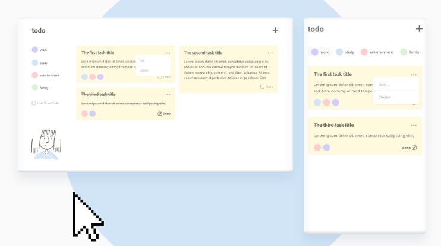
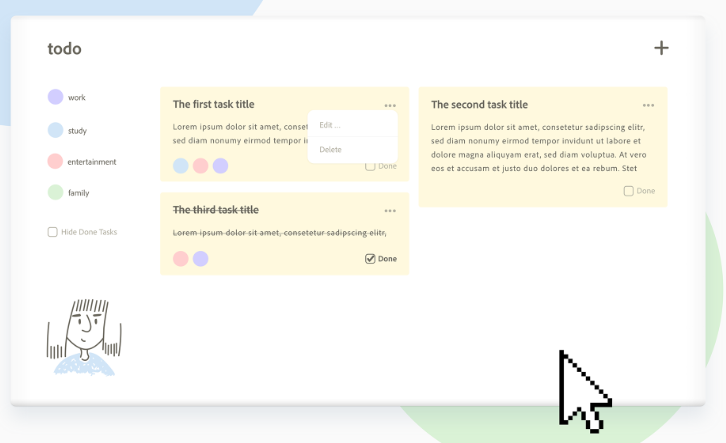

# todo-fullstack
A fullstack Monorepo WebApp..

## UI Design



## Mobile Design


## Desktop Design



This repository contains a fullstack monorepo for a Todo web application. The application is built using modern web technologies and follows best practices for both frontend and backend development. It includes features such as user authentication, task management, and real-time updates.

## Features

- **User Authentication**: Secure login and registration system.(upcoming)
- **Task Management**: Create, update, delete, and organize tasks.
- **Real-time Updates**: Instant updates across all connected clients.
- **Responsive Design**: Optimized for both desktop and mobile devices.
- **Monorepo Structure**: Single repository for both frontend and backend code, simplifying development and deployment.

## Technologies Used

- **Frontend**: React, Tailwind CSS
- **Backend**: Node.js, Express, MongoDB
- **Authentication**: JWT (JSON Web Tokens)(upcoming)
- **Real-time Communication**: Socket.io(upcoming)
- **Build Tools**: Webpack, Babel
- **Testing**: Jest, React Testing Library (upcoming)

## Getting Started

To get started with the development environment, follow these steps:

1. Clone the repository:
    ```sh
    git clone https://github.com/yourusername/todo-fullstack.git
    ```

2. Install dependencies:
    ```sh
    cd todo-fullstack
    npm install
    ```

3. Start the development server:
    ```sh
    npm run dev
    ```

4. Open your browser and navigate to `http://localhost:3000`.

## Contributing

We welcome contributions!

## License

This project is licensed under the MIT License. See the [LICENSE](LICENSE) file for more details.